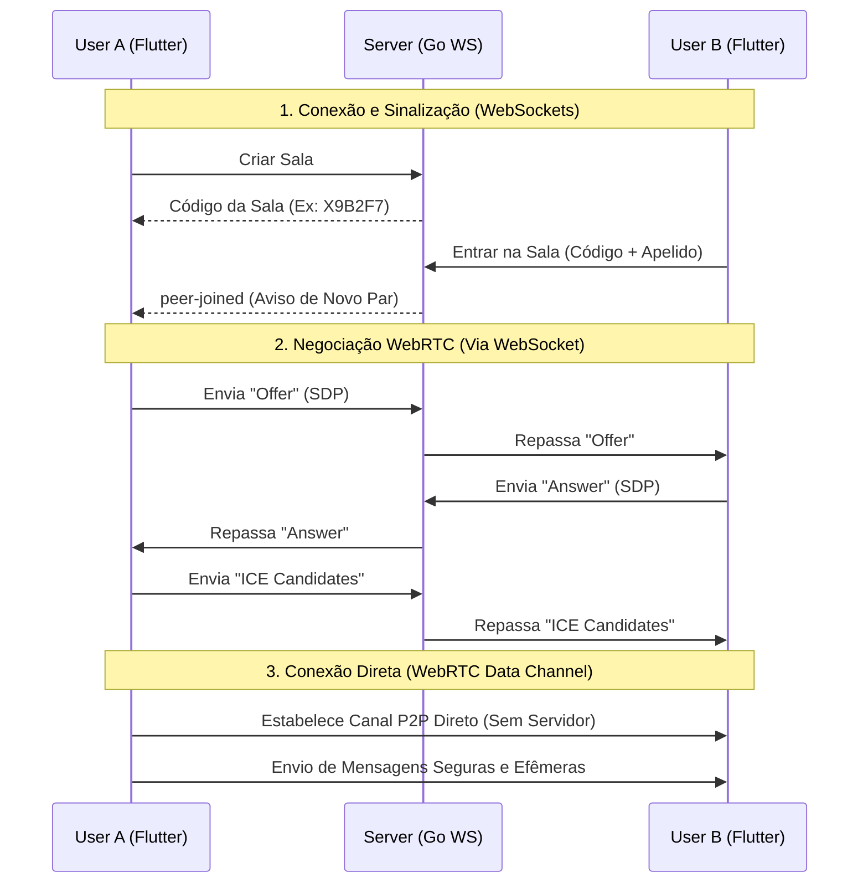

# Smoke (SMK) 💬

Um aplicativo de chat efêmero com segurança de ponta a ponta que utiliza **WebRTC** e **WebSockets** para comunicação direta entre dispositivos, sem armazenamento permanente de mensagens no servidor.

---

## 🏗️ Arquitetura do Projeto

O SMK é dividido em duas partes principais: um **Backend de Sinalização (Go)** e um **Cliente Frontend (Flutter)**.



### 1. Cliente (Frontend) - Flutter
- **Tecnologias:** Flutter, `flutter_webrtc`, `web_socket_channel`.
- **Papel:**
  - Interface do usuário moderna e reativa.
  - Conexão inicial via WebSocket com o servidor para negociação de canal (Signaling).
  - Estabelecimento de canal de dados P2P direto usando `RTCDataChannel` do WebRTC.
  - Criptografia automática de transporte ponta a ponta fornecida pelo protocolo WebRTC (DTLS-SRTP).

### 2. Servidor de Sinalização (Backend) - Go
- **Tecnologias:** Go (Golang), `gorilla/websocket`.
- **Papel:**
  - Gerenciamento de salas na memória (sem banco de dados).
  - Encaminhamento de mensagens de sinalização (SDP Offers, Answers e ICE Candidates) entre os usuários de uma mesma sala.
  - Após a conexão WebRTC direta ser estabelecida entre os usuários, o servidor de sinalização deixa de processar as mensagens do chat.

---

## 📡 Como a Conexão Funciona em Redes Diferentes?

- **STUN (NAT Traversal):** O aplicativo vem pré-configurado com os servidores STUN públicos do Google. Eles são usados para descobrir o IP público de cada dispositivo, permitindo a conexão direta (P2P) mesmo que os usuários estejam atrás de roteadores domésticos normais.
- **Servidor Público:** Para funcionar com pessoas em redes totalmente diferentes, o backend em Go deve ser publicado em um servidor com IP público (ex: Fly.io, Railway, etc.) ou exposto através de um túnel (ex: ngrok). As URLs de API e WebSocket no arquivo `lib/main.dart` do frontend devem apontar para esse endereço público.

---

## 🚀 Como Executar Localmente

### Pré-requisitos
- **Go** (versão 1.22+)
- **Flutter SDK**

---

### 1. Executando o Backend
Abra o terminal na pasta raiz e execute:
```bash
cd backend
go run .
```
O servidor iniciará na porta `:8080`.

---

### 2. Executando o Frontend
Em outro terminal na pasta raiz:
```bash
cd frontend
flutter run
```
Selecione o dispositivo desejado (Linux, Web, Android ou iOS) para iniciar o cliente.
